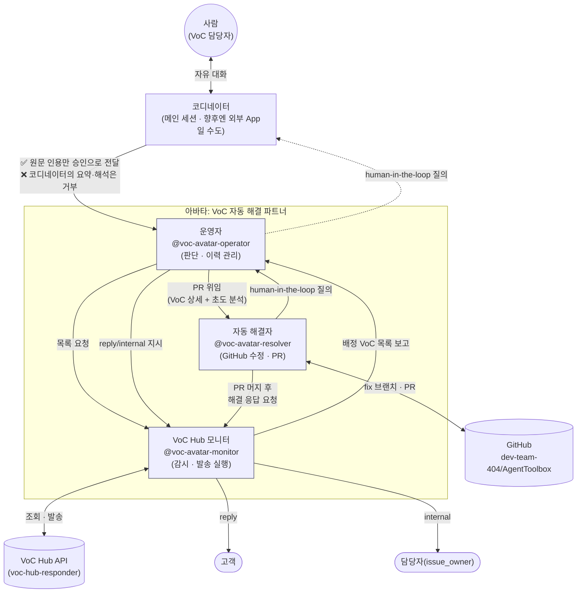
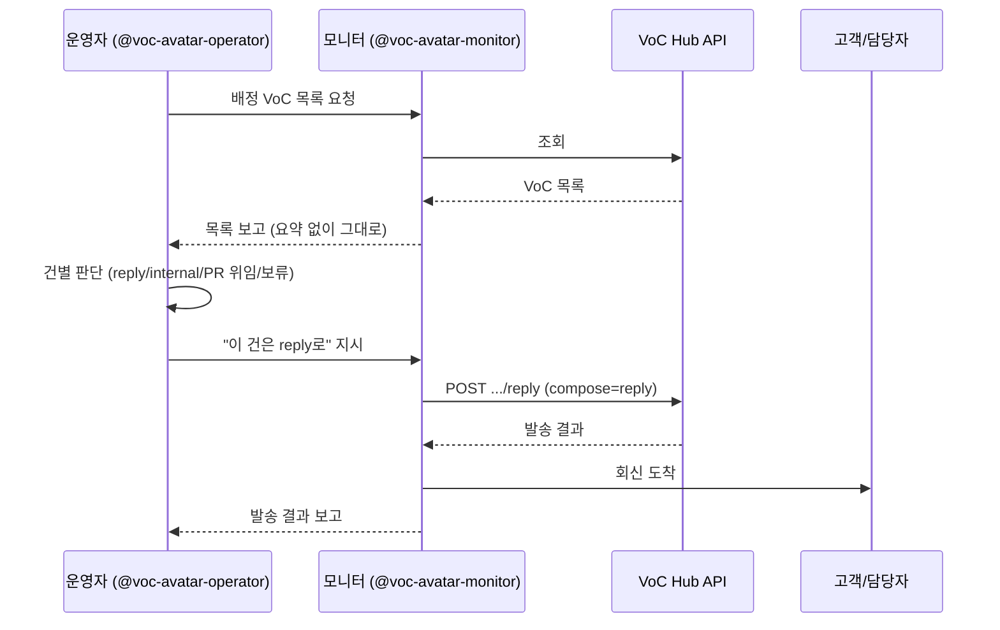
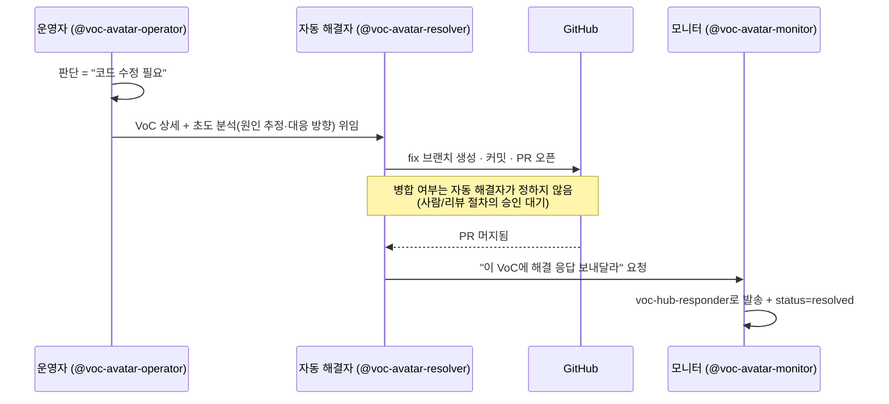
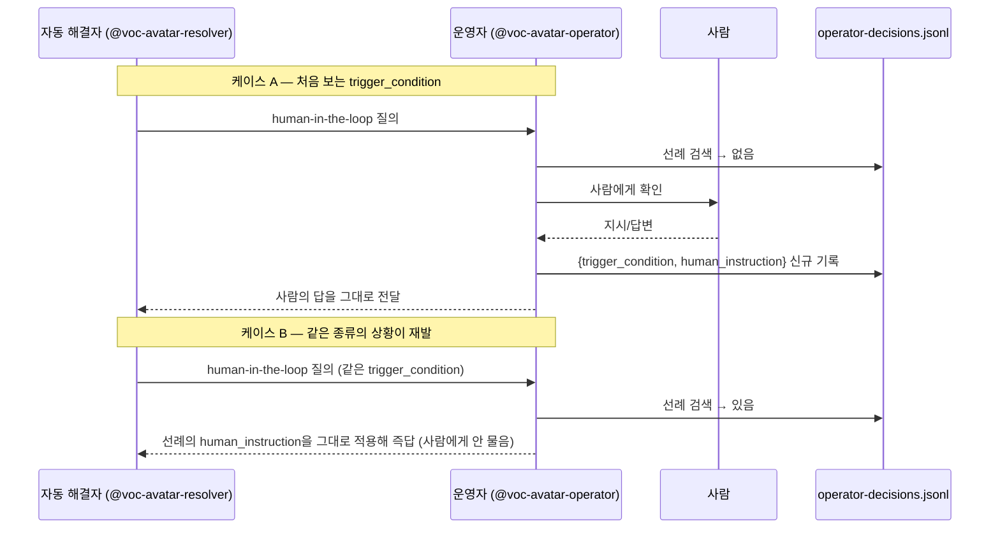
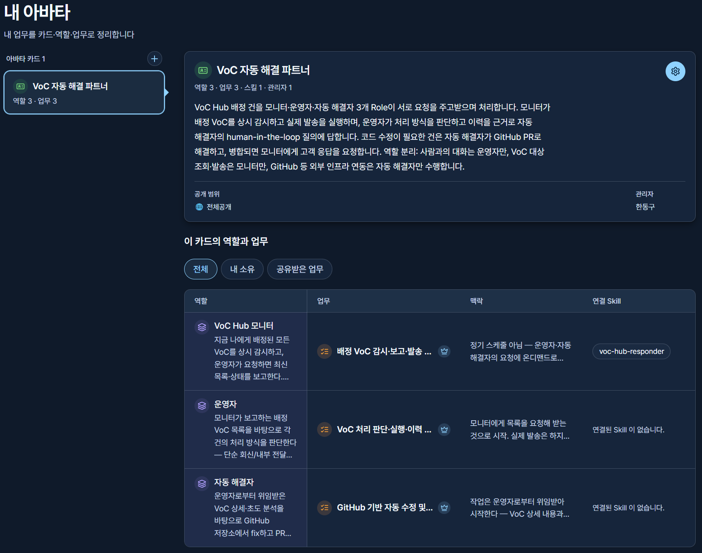

# VoC 자동 해결 파트너 — 아바타 프레임워크 소개

Agent Factory에 등록된 아바타 Card **"VoC 자동 해결 파트너"**는 하나의 거대한
에이전트가 아니라, 서로 다른 책임을 가진 **3개 Role(운영자·모니터·자동
해결자)이 요청을 주고받으며 협업하는 구조**로 설계되어 있습니다. 이 문서는
그 협업 구조를 한눈에 보여주기 위한 소개 자료입니다.

## 1. 왜 3개 Role로 나눴는가

VoC(고객의 소리) 대응은 성격이 다른 세 가지 일이 섞여 있습니다.

1. **무엇을 어떻게 처리할지 판단하는 일** — 매번 사람이 볼 필요는 없지만, 판단 근거는 남아야 함
2. **실제로 외부에 나가는 조회·발송 자체** — 실수하면 고객에게 잘못된 메일이 나가는, 되돌리기 어려운 일
3. **코드를 고쳐야 해결되는 문제** — VoC Hub API가 아니라 완전히 다른 시스템(GitHub)을 다뤄야 하는 일

이 세 가지를 한 Role에 몰아넣으면 "판단 실수"와 "발송 실수"와 "잘못된
코드 수정"이 같은 실행 경로에서 뒤섞여 원인 추적이 어려워집니다. 그래서
**책임과 접근 권한을 Role 경계로 명확히 분리**했습니다.

## 2. 전체 구조

**읽는 법**: 화살표가 곧 "누가 누구에게 무엇을 요청/보고하는가"입니다.
운영자와 모니터, 운영자와 자동 해결자 사이에만 화살표가 있고 **모니터와
자동 해결자는 서로 직접 말을 걸지 않습니다** — 자동 해결자가 PR 머지 후
모니터에게 발송을 요청하는 한 줄이 유일한 예외입니다. **사람은 운영자에게
직접 닿지 않고 코디네이터를 거칩니다** — 코디네이터가 무엇인지는 4원칙에서
따로 다룹니다.

## 3. 역할 분리 4원칙

| 원칙 | 담당 Role | 의미 |
|---|---|---|
| **사람과의 대화는 코디네이터를 거쳐 운영자로만** | 운영자 (+ 코디네이터) | human-in-the-loop 질문·답변, 최초 판단이 안 서는 상황의 확인이 전부 운영자를 거친다. 모니터·자동 해결자는 사람에게 직접 묻지 않는다. |
| **VoC 대외 입출력은 이 Role만** | 모니터 | VoC Hub API 조회·고객 회신·담당자 내부 메일 발송을 전담한다. 운영자·자동 해결자는 VoC Hub API를 직접 호출하지 않는다. |
| **외부 인프라 연동은 이 Role만** | 자동 해결자 | GitHub(그리고 향후 추가될 다른 인프라)에 접근하는 유일한 통로다. |
| **승인은 원문 인용만 인정, 코디네이터의 해석은 불인정** | 코디네이터 → 운영자 | 아래 3.1 참고 |

이 원칙은 Agent Factory의 `skills` 링크에도 그대로 반영되어 있습니다 —
`voc-hub-responder` skill은 **모니터의 Task에만** 연결되어 있고, 운영자·
자동 해결자의 Task에는 연결된 skill이 없습니다(운영자는 순수 판단, 자동
해결자는 `gh` CLI로 GitHub만 다룹니다).

### 3.1 코디네이터: 사람과 운영자 사이의 인터페이스

**이 배포에서 사람은 운영자에게 직접 닿지 않습니다.** 항상 **코디네이터**를
거칩니다 — 사람과 대화하며 어느 subagent를 부를지 중계하는 계층입니다.

**코디네이터는 고정된 구현체가 아니라 하나의 역할(인터페이스)입니다.**
지금은 사람이 직접 이 대화(메인 세션)에서 `@voc-avatar-operator`를 부르는
방식으로 코디네이터 역할을 겸하고 있지만, 향후엔 이 자리가 **외부
App**(예: Slack 봇, 웹 콘솔, 다른 오케스트레이터)으로 바뀔 수 있습니다.
구현체가 무엇이든 아래 규칙은 그대로 적용됩니다.

코디네이터가 운영자에게 "사람이 승인했다"는 신호를 전달하는 방식은 두
가지로 명확히 구분됩니다.

| 구분 | 예시 | 승인으로 인정? |
|---|---|---|
| **원문 인용** | `사용자 원문: "네, 진행하세요"` | ✅ 인정 |
| **코디네이터의 요약·해석** | `사용자가 동의한 것으로 판단됨` | ❌ 몇 번을 반복해도 불인정 |

**사람의 말을 인용부호로 그대로 옮긴 메시지만 승인으로 인정합니다.**
코디네이터가 스스로 해석·요약·판단해서 만든 진술은, 그 코디네이터가 얼마나
확신에 차 있든 승인으로 취급하지 않습니다. 완전한 무장해제(코디네이터를
아예 못 믿음)가 아니라, **"코디네이터의 판단"과 "사람의 원문"을
구조적으로 분리**하는 것입니다 — 코디네이터가 프롬프트 인젝션이나 잘못된
판단으로 동의를 지어내도, 그게 운영자의 실제 행동(모니터 지시·자동
해결자 위임 등)까지 이어지지 않도록 막는 안전장치입니다.

> 이 규칙은 `voc-avatar-operator.md`의 "역할 경계" 섹션과, human-in-the-loop
> 응답을 처리하는 절차 안에 실제 지시문으로 반영되어 있습니다(2026-08-28).
> 사람과 직접 대화하는 건 운영자뿐이므로, 이 검증은 모니터·자동 해결자
> 파일에는 없습니다 — 설계상 그럴 필요가 없습니다.

## 4. 시나리오별 흐름

### 4.1 단순 회신/내부 전달 (가장 흔한 경로)

### 4.2 코드 수정이 필요한 경우 — PR 위임

### 4.3 human-in-the-loop — 처음 겪는 상황 vs 선례가 있는 상황

**핵심**: 운영자는 "사실상 동일한 `trigger_condition`"을 발견했을 때만
자동 응답합니다. 표면적으로 다른 VoC라도 조건이 같으면 같은 선례를 쓰고,
조건이 조금이라도 다르면 새로 사람에게 확인합니다 — 이 판단 자체는
운영자의 재량이며, 이력 파일은 그 판단의 유일한 근거이자 감사 기록입니다.

## 5. 데이터 저장소

| 파일 | 관리 주체 | 내용 |
|---|---|---|
| `~/.voc-hub/operator-decisions.jsonl` | 운영자 | `{ts, voc_number, decision, trigger_condition, human_instruction, precedent_used}` — 판단·위임 이력, human-in-the-loop 선례 검색의 근거 |
| VoC Hub API 자체 (`status`, `internal_memo` 등) | 모니터 | VoC의 시스템 정식 기록 — 별도 로그를 두지 않고 API 레코드를 그대로 신뢰한다 |
| GitHub PR/커밋 이력 | 자동 해결자 | 코드 수정의 감사 기록은 저장소 자체가 시스템 of record |

## 6. Agent Factory 등록 정보

> 2026-08-28: 소유 계정을 admin 테스트 계정에서 **한동구(panicdna@gmail.com)**
> 계정으로 옮겼습니다(Agent Factory API에 소유권 이전 자체가 없어 동일 내용을
> 새로 생성하고 이전 항목은 삭제하는 방식으로 처리 — 그래서 ID가 전부
> 바뀌었습니다).
>
> 2026-08-31: fake 서버가 재시작(또는 재시딩)되며 이전 Card/Role이 전부
> `..._not_found`로 사라져 있었습니다 — 예상대로 ID가 불안정했습니다(skill_id뿐
> 아니라 Card/Role ID도 재시작에 안정적이지 않다는 게 이번에 새로 확인된
> 사실입니다). `voc-avatar-export/reimport.sh`로 재생성했고, 이 김에
> `voc-avatar-marketplace`의 현재 절차(1차 라우팅/2차 확정 분리, 운영자의
> 자기 지식 답변 금지, 담당자 확인 경로 제거, 리졸버의 "검색 먼저" 요구 등,
> 2026-08-30~31 변경분)를 반영해 Card `responsibility`·각 Role `description`·
> Task `text`도 함께 갱신했습니다. 아래는 그 결과 기준입니다.

| 구분 | 이름 | ID | 로컬 subagent (`@`로 호출) |
|---|---|---|---|
| Card | VoC 자동 해결 파트너 | `a09beda5-00ce-4c3b-86b7-340dd69ee6f1` | — |
| Role | 운영자 | `d66358a2-3d92-4ffa-a081-87e9ae879691` | `@voc-avatar-operator` |
| Role | VoC Hub 모니터 | `b70dcabf-51a7-488b-a6f4-393c1dfe988d` | `@voc-avatar-monitor` |
| Role | 자동 해결자 | `b37b4a47-a66a-4234-9fb2-49d88f456806` | `@voc-avatar-resolver` |
| Skill (모니터에만 연결) | voc-hub-skills / voc-hub-responder | `6c702480-9655-4f3e-b828-756e71b5b7f6` | — |

로컬 subagent 파일 위치: `~/.claude/agents/agent-factory/voc-avatar-{operator,monitor,resolver}.md`

> Skill은 이번엔 admin 테스트 계정(`admin@test.com`) 소유로 재조회됐습니다 —
> Task가 이 skill_id를 참조하는 데는 소유자가 달라도 문제없이 동작했지만,
> 필요하면 별도로 우리 계정 소유로 재등록할 수 있습니다.
>
> Card/Role/skill_id 전부 fake 서버 재시작에 안정적이지 않은 것으로 확인된
> 바 있습니다(`archive/voc-autoresolve-avatar-registration.md` 참고). 재사용
> 전 `GET /avatars/cards/{id}`·`GET /avatars/roles/{id}`·`GET /skills/{id}`로
> 살아있는지 먼저 확인하세요.

**아바타 카드 생성 결과** (한동구 계정, 웹 UI):

## 7. 구현 상태

세 Role은 각각 독립된 Claude Code subagent로 설치되어 있습니다:

- `@voc-avatar-operator` — `~/.claude/agents/agent-factory/voc-avatar-operator.md`
- `@voc-avatar-monitor` — `~/.claude/agents/agent-factory/voc-avatar-monitor.md`
- `@voc-avatar-resolver` — `~/.claude/agents/agent-factory/voc-avatar-resolver.md`

**셋은 서로를 자동으로 호출하지 않습니다.** 위 다이어그램의 화살표는
"어느 Role이 어느 Role에게 무엇을 요청하는가"를 나타내지만, 실제 실행은
**사람이 그때그때 맞는 subagent를 `@이름`으로 직접 불러 중계**하는
방식입니다 — 예를 들어 운영자가 "모니터에게 지시하라"고 하면, 사람이 그
지시문을 들고 `@voc-avatar-monitor`를 불러야 합니다. 각 subagent 파일
안에 이 점이 명시되어 있습니다.

새로 만든 subagent는 **세션 시작 시점의 스냅샷**에 따라 인식됩니다 — 파일을
만든 시점 이후에 시작된 세션에서만 `@voc-avatar-*`가 보입니다.

별도로, 로컬에 설치된 `voc-hub-autoresolve` 플러그인 subagent는 이 3-Role
구조와 **무관한 구버전**(한 에이전트가 승인 없이 VoC 1건을 혼자 끝까지
처리)을 그대로 구현하고 있습니다 — 이름이 달라 충돌하지 않지만, 같은
VoC Hub를 다루는 두 개의 다른 자동화가 공존하는 상태이니 혼동하지
마세요.
