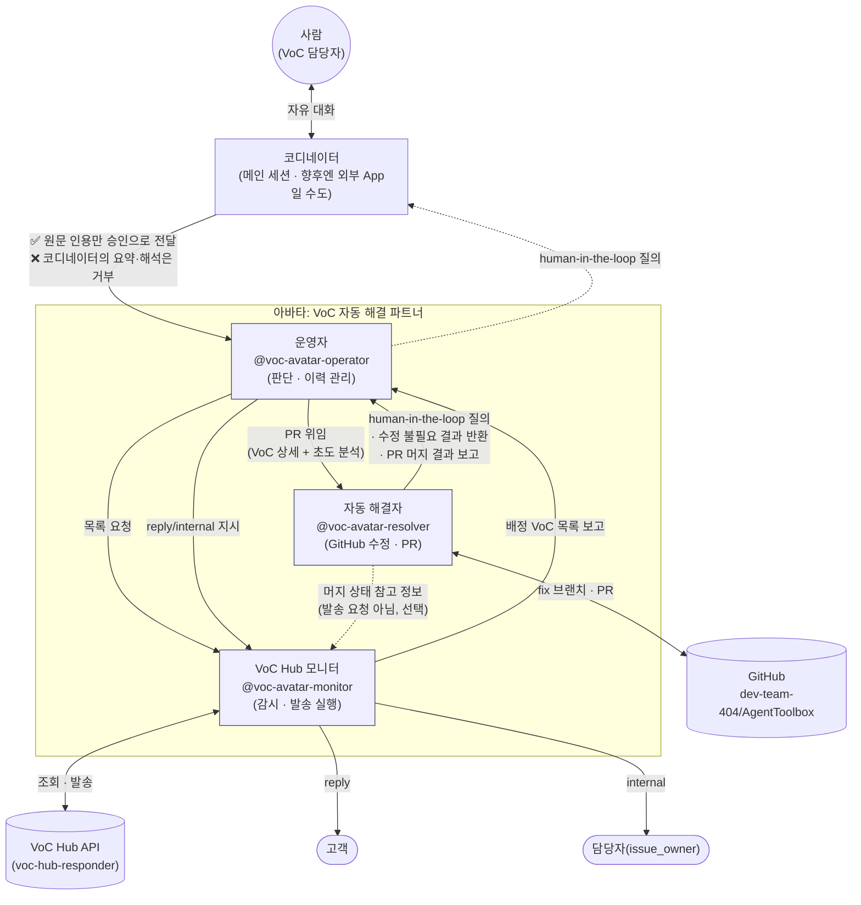
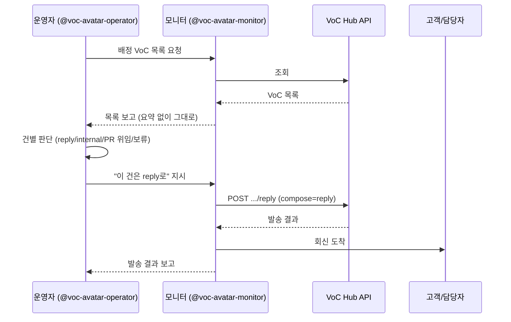
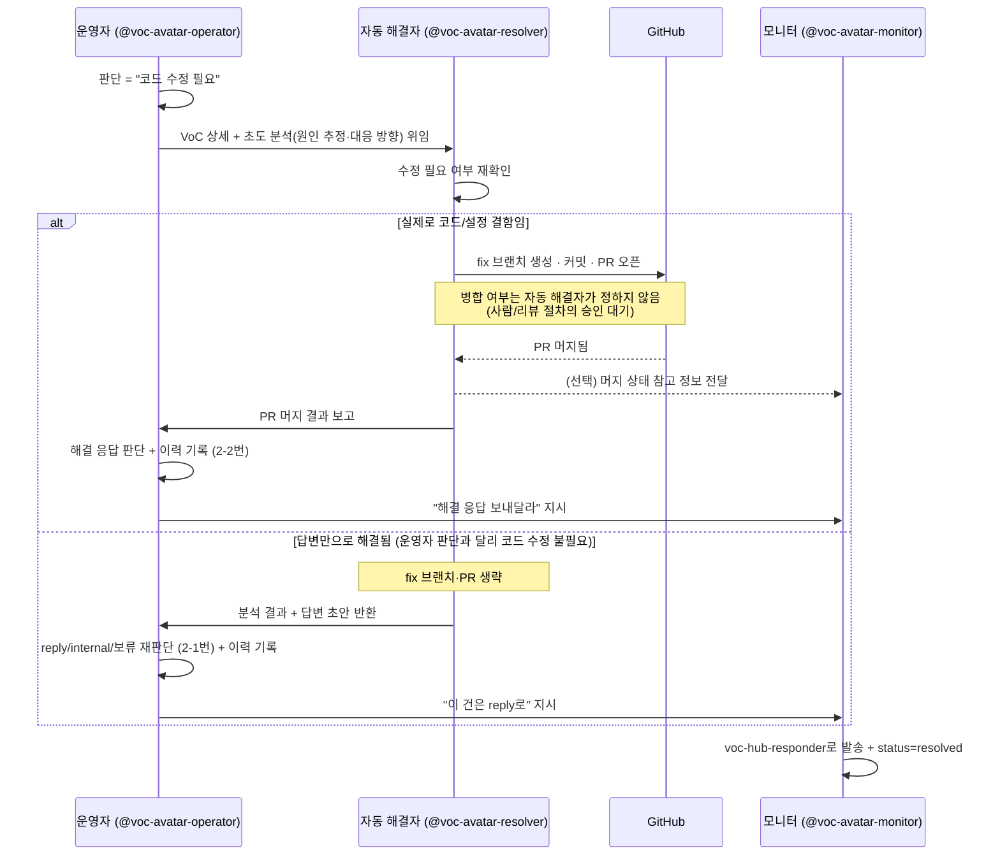
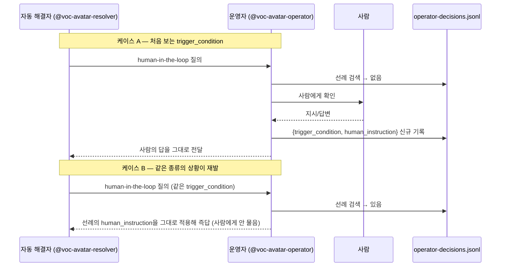

# VoC 자동 해결 파트너 — 아바타 프레임워크 소개

Agent Factory에 등록된 아바타 Card **"VoC 자동 해결 파트너"**는 하나의 거대한
에이전트가 아니라, 서로 다른 책임을 가진 **3개 Role(운영자·모니터·자동
해결자)이 요청을 주고받으며 협업하는 구조**로 설계되어 있습니다. 이 문서는
그 협업 구조를 한눈에 보여주기 위한 소개 자료입니다.

## 1. 왜 3개 Role로 나눴는가

VoC(고객의 소리) 대응은 성격이 다른 세 가지 일이 섞여 있습니다.

1. **무엇을 어떻게 처리할지 판단하는 일** — 매번 사람이 볼 필요는 없지만, 판단 근거는 남아야 함
2. **실제로 외부에 나가는 조회·발송 자체** — 실수하면 고객에게 잘못된 메일이 나가는, 되돌리기 어려운 일
3. **코드를 고쳐야 해결되는 문제** — VoC Hub API가 아니라 완전히 다른 시스템(GitHub)을 다뤄야 하는 일

이 세 가지를 한 Role에 몰아넣으면 "판단 실수"와 "발송 실수"와 "잘못된
코드 수정"이 같은 실행 경로에서 뒤섞여 원인 추적이 어려워집니다. 그래서
**책임과 접근 권한을 Role 경계로 명확히 분리**했습니다.

## 2. 전체 구조



**읽는 법**: 화살표가 곧 "누가 누구에게 무엇을 요청/보고하는가"입니다.
운영자와 모니터, 운영자와 자동 해결자 사이에만 실선(명령/위임) 화살표가
있습니다 — **"발송해 달라"는 요청은 모두 운영자를 거쳐 모니터에게
갑니다.** 자동 해결자와 모니터 사이의 점선은 유일한 예외이자 유일한 직접
연결이지만, 이것도 명령이 아니라 "PR이 머지됐다"는 상태 정보를 모니터가
참고하라고 남겨두는 것뿐입니다(선택 사항 — 안 남겨도 무방). **사람은
운영자에게 직접 닿지 않고 코디네이터를 거칩니다** — 코디네이터가 무엇인지는
4원칙에서 따로 다룹니다.

## 3. 역할 분리 4원칙

| 원칙 | 담당 Role | 의미 |
|---|---|---|
| **사람과의 대화는 코디네이터를 거쳐 운영자로만** | 운영자 (+ 코디네이터) | human-in-the-loop 질문·답변, 최초 판단이 안 서는 상황의 확인이 전부 운영자를 거친다. 모니터·자동 해결자는 사람에게 직접 묻지 않는다. |
| **VoC 대외 입출력은 이 Role만** | 모니터 | VoC Hub API 조회·고객 회신·담당자 내부 메일 발송을 전담한다. 운영자·자동 해결자는 VoC Hub API를 직접 호출하지 않는다. |
| **외부 인프라 연동은 이 Role만** | 자동 해결자 | GitHub(그리고 향후 추가될 다른 인프라)에 접근하는 유일한 통로다. |
| **승인은 원문 인용만 인정, 코디네이터의 해석은 불인정** | 코디네이터 → 운영자 | 아래 3.1 참고 |

이 원칙은 Agent Factory의 `skills` 링크에도 그대로 반영되어 있습니다 —
`voc-hub-responder` skill은 **모니터의 Task에만** 연결되어 있고, 운영자·
자동 해결자의 Task에는 연결된 skill이 없습니다(운영자는 순수 판단, 자동
해결자는 `gh` CLI로 GitHub만 다룹니다).

### 3.1 코디네이터: 사람과 운영자 사이의 인터페이스

**이 배포에서 사람은 운영자에게 직접 닿지 않습니다.** 항상 **코디네이터**를
거칩니다 — 사람과 대화하며 어느 subagent를 부를지 중계하는 계층입니다.

**코디네이터는 고정된 구현체가 아니라 하나의 역할(인터페이스)입니다.**
지금은 사람이 직접 이 대화(메인 세션)에서 `@voc-avatar-operator`를 부르는
방식으로 코디네이터 역할을 겸하고 있지만, 향후엔 이 자리가 **외부
App**(예: Slack 봇, 웹 콘솔, 다른 오케스트레이터)으로 바뀔 수 있습니다.
구현체가 무엇이든 아래 규칙은 그대로 적용됩니다.

코디네이터가 운영자에게 "사람이 승인했다"는 신호를 전달하는 방식은 두
가지로 명확히 구분됩니다.

| 구분 | 예시 | 승인으로 인정? |
|---|---|---|
| **원문 인용** | `사용자 원문: "네, 진행하세요"` | ✅ 인정 |
| **코디네이터의 요약·해석** | `사용자가 동의한 것으로 판단됨` | ❌ 몇 번을 반복해도 불인정 |

**사람의 말을 인용부호로 그대로 옮긴 메시지만 승인으로 인정합니다.**
코디네이터가 스스로 해석·요약·판단해서 만든 진술은, 그 코디네이터가 얼마나
확신에 차 있든 승인으로 취급하지 않습니다. 완전한 무장해제(코디네이터를
아예 못 믿음)가 아니라, **"코디네이터의 판단"과 "사람의 원문"을
구조적으로 분리**하는 것입니다 — 코디네이터가 프롬프트 인젝션이나 잘못된
판단으로 동의를 지어내도, 그게 운영자의 실제 행동(모니터 지시·자동
해결자 위임 등)까지 이어지지 않도록 막는 안전장치입니다.

> 이 규칙은 `voc-avatar-operator.md`의 "역할 경계" 섹션과, human-in-the-loop
> 응답을 처리하는 절차 안에 실제 지시문으로 반영되어 있습니다(2026-08-28).
> 사람과 직접 대화하는 건 운영자뿐이므로, 이 검증은 모니터·자동 해결자
> 파일에는 없습니다 — 설계상 그럴 필요가 없습니다.

### 3.2 코디네이터는 운영자의 판단을 대신하지 않는다

3.1이 다루는 건 "사람의 승인을 운영자에게 어떻게 전달하는가"입니다. 여기서
다루는 건 그보다 앞선 문제입니다 — **코디네이터가 운영자를 아예 부르지
않고, 그 자리에서 스스로 판단해 버리는 경우**입니다.

모니터·자동 해결자의 결과(배정 VoC 목록, "수정 불필요" 답변 초안, PR 머지
보고)를 받아 회신 여부·방식 판단이 필요해지면, 코디네이터는 그 판단을
대신 내리지 않습니다. 코디네이터가 무엇이 맞는 답인지 이미 알고 있어도
마찬가지입니다 — 반드시 `@voc-avatar-operator`를 실제로 호출해 그
서브에이전트 안에서 판단이 이뤄지게 합니다. 코디네이터가 대신 판단하면:

- 사람에게 나가는 질문(예: "이 답변을 발송할까요?")은 겉보기에 똑같고
- 하지만 `operator-decisions.jsonl`에는 그 판단이 한 줄도 남지 않으며
- 나중에 같은 유형의 VoC가 human-in-the-loop로 올 때 참고할 선례도 비어
  있게 됩니다

이 차이는 대화 로그만 봐서는 구분되지 않습니다 — 코디네이터가 "운영자라면
이렇게 판단했을 것"이라고 스스로 추론했는지, 실제로 운영자 서브에이전트를
호출했는지는 서브에이전트 실행 여부로만 확인할 수 있습니다. 이 규칙은
`CLAUDE.md`의 "voc-avatar-partner 사용 시 코디네이터 규칙" 절에도
반영되어 있습니다.

## 4. 시나리오별 흐름

### 4.1 단순 회신/내부 전달 (가장 흔한 경로)



### 4.2 코드 수정이 필요하다고 본 경우 — PR 위임 (자동 해결자가 재확인)



운영자의 "PR 위임" 판단은 위임 시점의 1차 판단일 뿐, 자동 해결자가 상세·초도
분석을 받은 뒤 다시 한번 "이게 정말 코드 수정이 필요한가"를 확인합니다 —
사용법 안내처럼 답변만으로 끝나는 VoC가 운영자 판단 실수로 넘어와도, 불필요한
fix 브랜치·PR을 만들지 않도록 하는 2차 안전장치입니다. 이 재확인 절차의 세부
분기는 `agents/voc-avatar-resolver.md`의 "절차 2번"을 참고합니다.

**두 분기 모두 "발송해 달라"는 요청은 모니터가 아니라 운영자에게
돌아갑니다.** 자동 해결자가 하는 일은 "코드 수정이 필요한가"와 "PR이
머지됐는가"까지고, 그 뒤에 실제로 보낼지·어떤 형식(reply/internal)으로
보낼지는 4.1과 마찬가지로 항상 운영자의 판단 영역입니다 — 그래야 이 판단이
`operator-decisions.jsonl`에 남고, 나중에 같은 유형의 VoC가
human-in-the-loop로 올 때 선례로 쓰일 수 있습니다
(`agents/voc-avatar-operator.md`의 "절차 2-1번" · "절차 2-2번"). PR 머지
분기에서 자동 해결자가 모니터에게 남기는 "머지 상태 참고 정보"는 예외처럼
보이지만 요청이 아니라 상태 통지일 뿐입니다 — 모니터가 그 VoC를 다시 마주칠
때(예: 고객이 재문의) 코드가 이미 고쳐졌다는 걸 알고 있도록 남기는 참고
기록이고, 생략해도 흐름은 깨지지 않습니다.

**사람이 운영자를 거치지 않고 자동 해결자를 곧바로 부른 경우도 마찬가지로
운영자에게 돌아와야 합니다.** 정규 경로(운영자 → 자동 해결자)를 생략했다고
해서 다음 단계 판단까지 생략하면, 그 판단은 `operator-decisions.jsonl`에
남지 않습니다 — 이 경우 자동 해결자의 최종 보고가 항상 "결과를
`@voc-avatar-operator`에게 전달하라"고 안내하도록 되어 있습니다
(`agents/voc-avatar-resolver.md`의 역할 경계 참고).

### 4.3 human-in-the-loop — 처음 겪는 상황 vs 선례가 있는 상황



**핵심**: 운영자는 "사실상 동일한 `trigger_condition`"을 발견했을 때만
자동 응답합니다. 표면적으로 다른 VoC라도 조건이 같으면 같은 선례를 쓰고,
조건이 조금이라도 다르면 새로 사람에게 확인합니다 — 이 판단 자체는
운영자의 재량이며, 이력 파일은 그 판단의 유일한 근거이자 감사 기록입니다.

## 5. 데이터 저장소

| 파일 | 관리 주체 | 내용 |
|---|---|---|
| `~/.voc-hub/operator-decisions.jsonl` | 운영자 | `{ts, voc_number, decision, trigger_condition, human_instruction, precedent_used}` — 판단·위임 이력, human-in-the-loop 선례 검색의 근거 |
| VoC Hub API 자체 (`status`, `internal_memo` 등) | 모니터 | VoC의 시스템 정식 기록 — 별도 로그를 두지 않고 API 레코드를 그대로 신뢰한다 |
| GitHub PR/커밋 이력 | 자동 해결자 | 코드 수정의 감사 기록은 저장소 자체가 시스템 of record |

## 6. Agent Factory 등록 정보

> 2026-08-28: 소유 계정을 admin 테스트 계정에서 **한동구(panicdna@gmail.com)**
> 계정으로 옮겼습니다(Agent Factory API에 소유권 이전 자체가 없어 동일 내용을
> 새로 생성하고 이전 항목은 삭제하는 방식으로 처리 — 그래서 ID가 전부
> 바뀌었습니다). 아래는 현재(한동구 소유) 기준입니다.

| 구분 | 이름 | ID | 로컬 subagent (`@`로 호출) |
|---|---|---|---|
| Card | VoC 자동 해결 파트너 | `0eb88455-b997-46d9-9a65-b25423bd14e3` | — |
| Role | 운영자 | `a8035c60-1d84-4871-a8af-5ced1c4f2acd` | `@voc-avatar-operator` |
| Role | VoC Hub 모니터 | `1ba34c00-add5-4c91-bd5c-bfb098973682` | `@voc-avatar-monitor` |
| Role | 자동 해결자 | `cae63e20-4b84-4052-afee-efb208c12aef` | `@voc-avatar-resolver` |
| Skill (모니터에만 연결) | voc-hub-skills / voc-hub-responder | `7c5abcec-8690-4476-b554-69a88286eb25` | — |

설치 방식: Claude Code 플러그인(`voc-avatar-partner`, `voc-avatar-marketplace` 마켓플레이스)으로 배포됩니다.

> **설치 전제조건:** `@voc-avatar-monitor`는 VoC Hub와의 모든 통신에
> `voc-hub-responder` 스킬(별도 마켓플레이스 `voc-hub-skills`에서 배포)을 사용합니다.
> `voc-avatar-partner`만 설치하면 이 스킬이 없어 모니터의 첫 동작부터 실패합니다 —
> `voc-hub-skills` 마켓플레이스에서 `voc-hub-responder`를 별도로 설치해야 합니다.

> skill_id는 fake 서버 재시작에 안정적이지 않은 것으로 확인된 바 있습니다 — 서버가
> 재시작되면 같은 이름·owner로 재조회되면서 ID가 바뀌고, 이 과정에서 기존에 연결된
> skills 링크가 에러 없이 조용히 빈 배열로 떨어질 수 있습니다(Card/Role/Task 자체의
> ID는 재시작에도 유지됨 — Skill 카탈로그 항목만 이 문제가 있음). 재시작 이후엔
> 항상 `GET /skills?q=<검색어>`로 현재 ID를 다시 확인하고, 재사용 전
> `GET /skills/{id}`로 살아있는지 먼저 확인하세요.

**아바타 카드 생성 결과** (한동구 계정, 웹 UI):


## 7. 구현 상태

세 Role은 `voc-avatar-partner` 플러그인의 `agents/`에 번들되어 있고, 대시보드는 같은
플러그인의 `commands/voc-operator-dashboard.md` 슬래시 커맨드로 제공됩니다. 설치:

```bash
claude plugin marketplace add ./voc-avatar-marketplace
claude plugin install voc-avatar-partner@voc-avatar-marketplace --scope project
```

설치 후 `@voc-avatar-operator`, `@voc-avatar-monitor`, `@voc-avatar-resolver`로 각
Role을 부를 수 있고, `/voc-operator-dashboard`로 대시보드를 띄울 수 있습니다.

**셋은 서로를 자동으로 호출하지 않습니다.** 위 다이어그램의 화살표는
"어느 Role이 어느 Role에게 무엇을 요청하는가"를 나타내지만, 실제 실행은
**사람이 그때그때 맞는 subagent를 `@이름`으로 직접 불러 중계**하는
방식입니다 — 예를 들어 운영자가 "모니터에게 지시하라"고 하면, 사람이 그
지시문을 들고 `@voc-avatar-monitor`를 불러야 합니다. 각 subagent 파일
안에 이 점이 명시되어 있습니다.

새로 만든 subagent는 **세션 시작 시점의 스냅샷**에 따라 인식됩니다 — 파일을
만든 시점 이후에 시작된 세션에서만 `@voc-avatar-*`가 보입니다.

별도로, `voc-hub-autoresolve` 플러그인 subagent는 이 3-Role 구조와
**무관한 구버전**(한 에이전트가 승인 없이 VoC 1건을 혼자 끝까지 처리)이었고,
이 3-Role 설계가 지키려는 "발송은 항상 사람 승인 후"라는 원칙과 정면으로
충돌했습니다. 2026-08-28에 비활성화 → 재설치(활성) → 최종적으로 **완전
삭제**(설치·활성화 항목·마켓플레이스 등록·로컬 캐시 전부 제거)로 정리를
끝냈습니다. 지금 이 로컬 환경에서 VoC Hub를 자동으로 다루는 것은 **이
3-Role 구조뿐**입니다 — 승인 없이 혼자 발송까지 끝내는 경로는 더 이상
존재하지 않습니다. (소스 자체는 `voc-hub` 프로젝트 소유라 그쪽엔 남아있고,
필요하면 그 프로젝트에서 마켓플레이스를 다시 등록해 재설치할 수 있습니다.)
