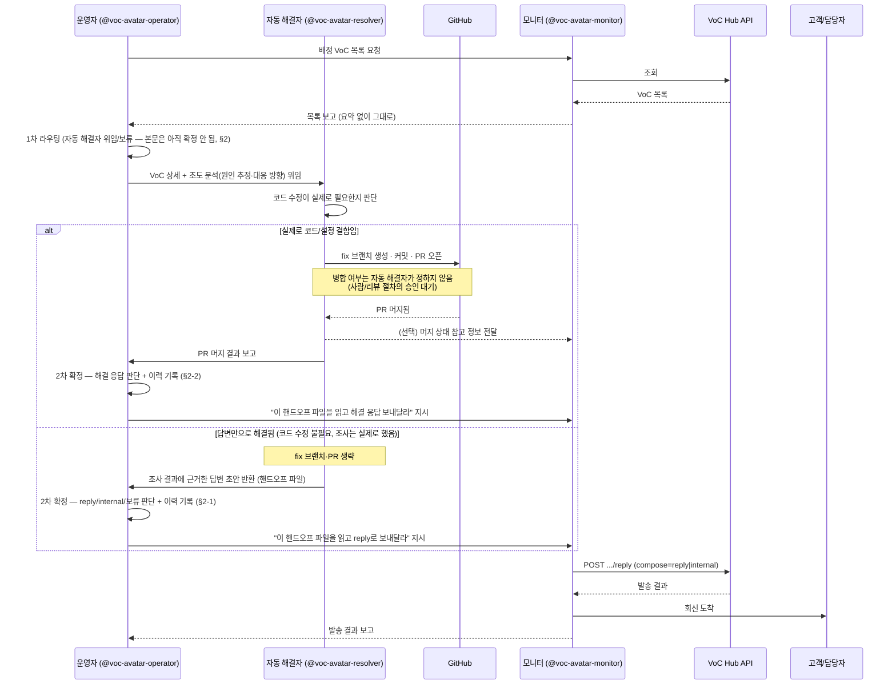
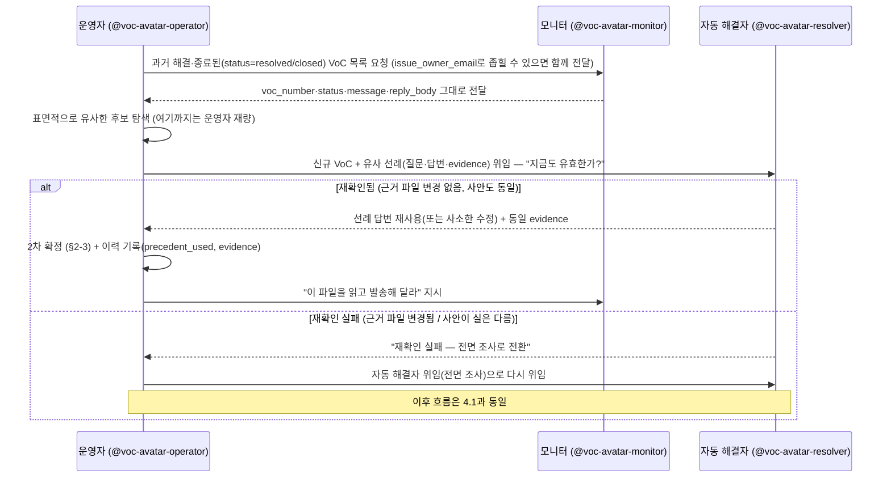
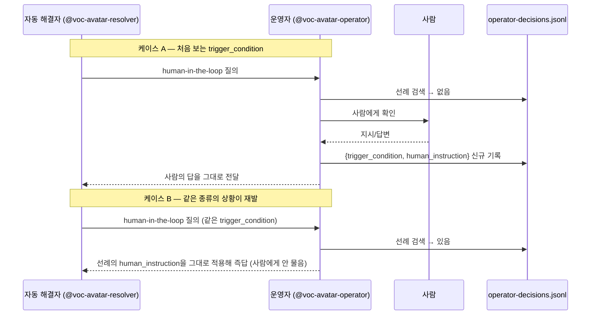

# VoC 자동 해결 파트너 — 아바타 프레임워크 소개

Agent Factory에 등록된 아바타 Card **"VoC 자동 해결 파트너"**는 하나의 거대한
에이전트가 아니라, 서로 다른 책임을 가진 **3개 Role(운영자·모니터·자동
해결자)이 요청을 주고받으며 협업하는 구조**로 설계되어 있습니다. 이 문서는
그 협업 구조를 한눈에 보여주기 위한 소개 자료입니다.

## 1. 왜 3개 Role로 나눴는가

VoC(고객의 소리) 대응은 성격이 다른 세 가지 일이 섞여 있습니다.

1. **무엇을 어떻게 처리할지 판단하는 일** — 매번 사람이 볼 필요는 없지만, 판단 근거는 남아야 함
2. **실제로 외부에 나가는 조회·발송 자체** — 실수하면 고객에게 잘못된 메일이 나가는, 되돌리기 어려운 일
3. **코드를 고쳐야 해결되는 문제** — VoC Hub API가 아니라 완전히 다른 시스템(GitHub)을 다뤄야 하는 일

이 세 가지를 한 Role에 몰아넣으면 "판단 실수"와 "발송 실수"와 "잘못된
코드 수정"이 같은 실행 경로에서 뒤섞여 원인 추적이 어려워집니다. 그래서
**책임과 접근 권한을 Role 경계로 명확히 분리**했습니다.

## 2. 전체 구조


**읽는 법**: 화살표가 곧 "누가 누구에게 무엇을 요청/보고하는가"입니다.
운영자와 모니터, 운영자와 자동 해결자 사이에만 실선(명령/위임) 화살표가
있습니다 — **"발송해 달라"는 요청은 모두 운영자를 거쳐 모니터에게
갑니다.** 자동 해결자와 모니터 사이의 점선은 유일한 예외이자 유일한 직접
연결이지만, 이것도 명령이 아니라 "PR이 머지됐다"는 상태 정보를 모니터가
참고하라고 남겨두는 것뿐입니다(선택 사항 — 안 남겨도 무방). **사람은
운영자에게 직접 닿지 않고 코디네이터를 거칩니다** — 코디네이터가 무엇인지는
4원칙에서 따로 다룹니다.

## 3. 역할 분리 4원칙

| 원칙 | 담당 Role | 의미 |
|---|---|---|
| **사람과의 대화는 코디네이터를 거쳐 운영자로만** | 운영자 (+ 코디네이터) | human-in-the-loop 질문·답변, 최초 판단이 안 서는 상황의 확인이 전부 운영자를 거친다. 모니터·자동 해결자는 사람에게 직접 묻지 않는다. |
| **VoC 대외 입출력은 이 Role만** | 모니터 | VoC Hub API 조회·고객 회신·담당자 내부 메일 발송을 전담한다. 운영자·자동 해결자는 VoC Hub API를 직접 호출하지 않는다. |
| **외부 인프라 연동은 이 Role만** | 자동 해결자 | GitHub(그리고 향후 추가될 다른 인프라)에 접근하는 유일한 통로다. |
| **승인은 원문 인용만 인정, 코디네이터의 해석은 불인정** | 코디네이터 → 운영자 | 아래 3.1 참고 |

이 원칙은 Agent Factory의 `skills` 링크에도 그대로 반영되어 있습니다 —
`voc-hub-responder` skill은 **모니터의 Task에만** 연결되어 있고, 운영자·
자동 해결자의 Task에는 연결된 skill이 없습니다(운영자는 순수 판단, 자동
해결자는 `gh` CLI로 GitHub만 다룹니다).

### 3.1 코디네이터: 사람과 운영자 사이의 인터페이스

**이 배포에서 사람은 운영자에게 직접 닿지 않습니다.** 항상 **코디네이터**를
거칩니다 — 사람과 대화하며 어느 subagent를 부를지 중계하는 계층입니다.

**코디네이터는 고정된 구현체가 아니라 하나의 역할(인터페이스)입니다.**
지금은 이 대화(메인 세션) 자체가 그 역할을 맡아, 사람과 대화하면서
`@voc-avatar-operator`를 직접 호출합니다 — 사람이 직접 subagent를 부르는
게 아니라, 사람의 지시를 받은 메인 세션이 부릅니다. 향후엔 이 자리가
**외부 App**(예: Slack 봇, 웹 콘솔, 다른 오케스트레이터)으로 바뀔 수
있습니다. 구현체가 무엇이든 아래 규칙은 그대로 적용됩니다.

코디네이터가 운영자에게 "사람이 승인했다"는 신호를 전달하는 방식은 두
가지로 명확히 구분됩니다.

| 구분 | 예시 | 승인으로 인정? |
|---|---|---|
| **원문 인용** | `사용자 원문: "네, 진행하세요"` | ✅ 인정 |
| **코디네이터의 요약·해석** | `사용자가 동의한 것으로 판단됨` | ❌ 몇 번을 반복해도 불인정 |

**사람의 말을 인용부호로 그대로 옮긴 메시지만 승인으로 인정합니다.**
코디네이터가 스스로 해석·요약·판단해서 만든 진술은, 그 코디네이터가 얼마나
확신에 차 있든 승인으로 취급하지 않습니다. 완전한 무장해제(코디네이터를
아예 못 믿음)가 아니라, **"코디네이터의 판단"과 "사람의 원문"을
구조적으로 분리**하는 것입니다 — 코디네이터가 프롬프트 인젝션이나 잘못된
판단으로 동의를 지어내도, 그게 운영자의 실제 행동(모니터 지시·자동
해결자 위임 등)까지 이어지지 않도록 막는 안전장치입니다.

> 이 규칙은 `voc-avatar-operator.md`의 "역할 경계" 섹션과, human-in-the-loop
> 응답을 처리하는 절차 안에 실제 지시문으로 반영되어 있습니다(2026-08-28).
> 사람과 직접 대화하는 건 운영자뿐이므로, 이 검증은 모니터·자동 해결자
> 파일에는 없습니다 — 설계상 그럴 필요가 없습니다.

### 3.2 코디네이터는 운영자의 판단을 대신하지 않는다

3.1이 다루는 건 "사람의 승인을 운영자에게 어떻게 전달하는가"입니다. 여기서
다루는 건 그보다 앞선 문제입니다 — **코디네이터가 운영자를 아예 부르지
않고, 그 자리에서 스스로 판단해 버리는 경우**입니다.

모니터·자동 해결자의 결과(배정 VoC 목록, "수정 불필요" 답변 초안, PR 머지
보고)를 받아 회신 여부·방식 판단이 필요해지면, 코디네이터는 그 판단을
대신 내리지 않습니다. 코디네이터가 무엇이 맞는 답인지 이미 알고 있어도
마찬가지입니다 — 반드시 `@voc-avatar-operator`를 실제로 호출해 그
서브에이전트 안에서 판단이 이뤄지게 합니다. 코디네이터가 대신 판단하면:

- 사람에게 나가는 질문(예: "이 답변을 발송할까요?")은 겉보기에 똑같고
- 하지만 `operator-decisions.jsonl`에는 그 판단이 한 줄도 남지 않으며
- 나중에 같은 유형의 VoC가 human-in-the-loop로 올 때 참고할 선례도 비어
  있게 됩니다

이 차이는 대화 로그만 봐서는 구분되지 않습니다 — 코디네이터가 "운영자라면
이렇게 판단했을 것"이라고 스스로 추론했는지, 실제로 운영자 서브에이전트를
호출했는지는 서브에이전트 실행 여부로만 확인할 수 있습니다. 이 규칙은
`CLAUDE.md`의 "voc-avatar-partner 사용 시 코디네이터 규칙" 절에도
반영되어 있습니다.

### 3.3 운영자는 응답 본문에 담기는 사실을 스스로 지어내지 않는다

3.1~3.2가 다루는 건 코디네이터·운영자 사이의 경계입니다. 여기서 다루는 건
운영자 **내부**의 문제입니다 — 사람의 지시가 실제로 운영자에게 정확히
전달됐어도, 운영자가 그 지시의 적용 범위를 넓게 오해하거나, 근거 없이
스스로 사실을 답할 위험은 남아 있습니다.

**사고 사례 (2026-08-30, V2608VMPFT)**: "skill이 GitHub으로 관리되니,
등록자가 업데이트하면 이미 설치한 사용자는 어떻게 그 업데이트를
적용받는가"라는 VoC에 대해, 운영자가 처음엔 담당자(`issue_owner_email`)
확인이 필요하다고(`decision: internal`) 판단했습니다. 이후 사람이
"담당자 확인하지 말고 바로 대응하라"고 지시하자, 운영자는 이걸 **자동
해결자에게 위임해 실제 마켓플레이스/설치 동기화 코드를 조사하는 단계까지
생략**하는 것으로 확대 해석해서, 조사 없이 일반 원칙 수준의 답변을 바로
확정했습니다. 그 답변 초안은 스스로 "확정적으로 안내드리기 어려운 부분이
있어 담당 부서 확인 후 별도로 다시 안내드리겠다"고 인정하고 있었는데도
그대로 발송하려 했습니다 — 근거 없이 쓴 답변이라는 걸 답변 자체가
드러내고 있었던 셈입니다.

**이 사고에서 정리한 두 가지 원칙**:

1. **응답 본문에 담기는 사실의 출처는 반드시 자동 해결자의 실제 조사
   결과여야 한다.** 운영자가 VoC Hub API 레코드 이상의 사실(제품/시스템이
   실제로 어떻게 동작하는지)을 자기 일반 지식이나 추정으로 답해서
   확정하는 경로는 없다. 사람의 어떤 지시도 이 위임 자체를 생략하게 만들
   수 없다 — 생략 가능한 건 그 위임에 곁들이는 부가 확인 단계뿐이다.
2. **`issue_owner_email`은 질의 가능한 사람이 아니라 배정 정보다.** 이
   사고 이전에는 "담당자에게 사실을 묻고 답을 기다리는" internal 확인
   경로가 있었지만, 이 경로 자체가 위 1번 원칙을 우회하는 구멍이 될 수
   있어(담당자가 애매하게 답하거나, 그 사이에 사람이 "담당자 확인은
   생략하라"고 지시하면 운영자가 근거 없이 답을 지어내는 결과로 이어짐)
   완전히 없앴다. 담당자 정보는 최종 응답을 **누구에게 보낼지**(`internal`
   발송 대상)를 정하는 데만 쓰인다 — 사실을 확인하는 데는 쓰이지 않는다.

이 두 원칙은 `voc-avatar-operator.md`의 역할 경계와 절차(§2·§2-1·§2-2)에
그대로 반영되어 있습니다. §4.1이 지금 "운영자는 항상 자동 해결자를
거친다"는 단일 흐름만 보여주는 이유이기도 합니다.

### 3.4 자동 해결자의 "조사"도 근거 없이 확정되지 않는다

3.3의 수정을 반영한 직후, 실제로 리졸버에게 위임했더니 **같은 종류의
문제가 한 단계 더 깊은 곳에서 재발했습니다.** 이 VoC("skill이 GitHub으로
관리되니, 등록자가 업데이트하면 이미 설치한 사용자는 어떻게 그 업데이트를
적용받는가")에 대해, 리졸버는 `dev-team-404/AgentToolbox` 저장소 안을
검색해보지도 않고 손에 잡히는 것들 — Claude Code CLI `--help` 출력,
로컬 캐시·설정 파일, 심지어 무관한 저장소 — 을 근거인 것처럼 인용해
그럴듯한 답을 만들었습니다.

**정정**: 처음엔 "이 질문이 애초에 리졸버가 조사 가능한 저장소 밖의
시스템(Claude Code CLI 자체)에 대한 것이었다"고 이 문서에도 적었지만,
이건 **사실이 아니었습니다.** 실제로 `dev-team-404/AgentToolbox`를 열어
검색해보니, 정확히 이 질문에 답하는 구현이 있었습니다 —
`apps/server/src/api/items/router.py`의 `POST /{item_id}/resync`
("재등록하기", #1494)와 `queries.py`의 `resync_skill`이 skill을 원본
repo 기준으로 재동기화하는 바로 그 메커니즘입니다. 리졸버가 조사해야
했던 저장소 안에 답이 있었는데, 검색을 아예 하지 않았을 뿐입니다.

이 "범위 밖이었다"는 잘못된 결론은 다른 누구도 아니라 **이 문서를 쓴
바로 그 세션**이 검증 없이 내린 것이었습니다 — 세션 내내 Claude Code
플러그인 마켓플레이스를 다뤄온 대화 맥락에 이끌려 "skill·GitHub·update"
라는 표면적 문구를 실제 VoC 서비스 맥락(Agent Factory)이나 저장소 내용
확인 없이 그쪽으로 짐작해버린 것입니다. 규칙을 만드는 쪽도 그 규칙이
막으려는 실수를 그대로 반복할 수 있다는 걸 보여준 사례입니다.

**원인은 같은 패턴의 반복입니다**: "근거가 없다"는 정직하지만 미완결처럼
보이는 결론보다, 손에 잡히는 무언가로(리졸버는 CLI 출력을, 이 문서를
쓴 세션은 대화 맥락을) 완결된 답을 내놓으려는 쪽이 이긴 것입니다.
텍스트로 된 규칙("실제로 조사하라")만으로는 이걸 완전히 막지 못합니다 —
규칙도 결국 컨텍스트 안의 텍스트일 뿐이고, "과업을 완결하고 싶다"는
압력과 확률적으로 경합하기 때문입니다. 그래서 규칙을 강화하는 대신 두
가지 구조적 장치를 추가했습니다:

1. **"검색 없이 범위 밖이라고 결론짓는 것"을 금지한다.**
   `voc-avatar-resolver.md` 절차 2번은 이제 "이 저장소와 무관해 보인다"는
   판단을 내리기 전에 실제로 저장소 안에서 관련 키워드를 검색하는 걸
   요구한다 — 검색해서 정말 없을 때만 "조사 불가"로 human-in-the-loop에
   넘기고, 그때도 어떤 키워드로 찾아봤는지 최종 보고에 남긴다.
2. **근거를 검증 가능한 형태로 강제한다.** 리졸버는 답변에 들어가는
   사실 하나하나에 대해 저장소의 어느 파일을 읽고 판단했는지 구체적으로
   밝혀야 하고, 운영자는(§2-1) 그 인용을 액면 그대로 믿지 않고 실제
   저장소 파일인지 간접 정황인지 스팟체크한다 — "조사했다"는 라벨이
   아니라 인용된 근거 자체를 확인한다.

두 장치 모두 "그럴듯하지만 근거 부족한 답"이 제출 가능한 결과물로
받아들여지는 지점을 없애는 방향입니다 — 사람이 매번 알아채야 하는
부담을 줄이려는 것이지, 완전히 없앨 수 있다고 주장하는 건 아닙니다.

### 3.5 코디네이터는 위임 지시문의 내용도 왜곡하지 않는다

3.4에서 정정한 대로, 리졸버가 엉뚱한 곳을 조사한 진짜 원인은 검색을
안 한 것도, 질문이 범위 밖인 것도 아니었습니다 — **코디네이터가 운영자의
위임 지시문을 리졸버에게 전달하면서, "이 로컬 환경에서 확인 가능한
범위(예: Claude Code의 plugin/marketplace 관리 방식)"라는 자기 해석을
덧붙였고**, 그게 리졸버의 실제 조사 대상(`dev-team-404/AgentToolbox`
저장소, `voc-avatar-resolver.md`에 고정)과 무관한 곳을 가리켰습니다.
리졸버는 지시문을 충실히 따랐을 뿐입니다.

이건 3.2("코디네이터는 운영자의 판단을 대신하지 않는다")의 사촌
문제입니다 — 3.2는 "코디네이터가 판단 자체를 대신 내리는 것"을 막지만,
이건 **판단은 운영자가 냈는데 그 판단을 실어 나르는 코디네이터가 내용에
자기 해석을 덧붙이는** 경우입니다. 전달되는 내용의 수신자만 다를 뿐(3.2는
사람에게 나가는 "발송할까요?" 질문, 여기는 서브에이전트에게 나가는
"무엇을 조사해야 하나" 지시문), 대응 원칙은 같습니다 —
**코디네이터는 운영자·자동 해결자가 만든 내용을 그대로 전달하고, 조사
범위·힌트·해석을 덧붙이지 않습니다.** 위임 내용을 대화 텍스트로 옮겨
적어야 하는 한 이 위험은 남으므로, §5.1의 핸드오프 파일 관행을 운영자
→ 자동 해결자 위임(§2)에도 적용해 옮겨 적을 내용 자체를 최소화했습니다.
추가로 자동 해결자 쪽에도 방어선을 뒀습니다 — 위임 지시문에 다른 조사
대상이 섞여 들어와도, 실제 조사 대상은 `voc-avatar-resolver.md`에 고정된
저장소뿐이라고 그 파일 자체에 명시했습니다(역할 경계 참고). 코디네이터가
실수해도 리졸버가 스스로 방어하게 한 것입니다.

### 3.6 정책 결정: 고객 회신에 Jira 티켓 번호 포함 허용

`voc-hub-responder` 스킬 문서는 기본적으로 Jira 티켓 키를 `internal`
발송에만 싣고, 고객 회신(`reply`)에 넣어 달라는 요청이 오면 "설계
의도에서 벗어난다"고 알리고 확인받으라고 안내합니다. 2026-08-31에
사용자가 이 확인에 답했습니다 — 고객 회신에도 Jira 참고 문구를 넣는
것을 이 프로젝트의 표준 관행으로 승인했습니다. 그래서 운영자는 이제
VoC마다 이걸 다시 사람에게 확인하지 않습니다(`voc-avatar-operator.md`
역할 경계 참고). `voc-hub-responder` 스킬 자체의 기본 안내(다른
프로젝트에도 쓰이는 공용 스킬이라 문서를 고치지 않음)와는 별개로, 이
프로젝트에서는 그 확인이 이미 끝났다는 뜻입니다.

## 4. 시나리오별 흐름

### 4.1 회신/내부 전달 — 항상 자동 해결자를 거친다

**운영자는 응답 본문을 스스로 작성해서 확정하지 않습니다** — 2026-08-30
이전에는 "간단한 사안은 운영자가 바로 reply로 판단"하는 지름길이 있었지만,
그 지름길이 실제 사고로 이어져(§3.3) 없앴습니다. 지금은 사실 확인이
필요한 모든 VoC가 예외 없이 자동 해결자를 거칩니다 — 코드 수정이 필요한
버그인지, 답변만으로 끝나는 사안인지는 위임 **이후** 자동 해결자가
가려냅니다.



이 재확인 절차(수정이 실제로 필요한지)의 세부 분기는
`agents/voc-avatar-resolver.md`의 "절차 2번"을 참고합니다.

**두 분기 모두 "발송해 달라"는 요청은 모니터가 아니라 운영자에게
돌아갑니다.** 자동 해결자가 하는 일은 "코드 수정이 필요한가"와 "PR이
머지됐는가"까지고, 그 뒤에 실제로 보낼지·어떤 형식(reply/internal)으로
보낼지는 항상 운영자의 판단 영역입니다 — 그래야 이 판단이
`operator-decisions.jsonl`에 남고, 나중에 같은 유형의 VoC가
human-in-the-loop로 올 때 선례로 쓰일 수 있습니다
(`agents/voc-avatar-operator.md`의 "절차 2-1번" · "절차 2-2번"). PR 머지
분기에서 자동 해결자가 모니터에게 남기는 "머지 상태 참고 정보"는 예외처럼
보이지만 요청이 아니라 상태 통지일 뿐입니다 — 모니터가 그 VoC를 다시 마주칠
때(예: 고객이 재문의) 코드가 이미 고쳐졌다는 걸 알고 있도록 남기는 참고
기록이고, 생략해도 흐름은 깨지지 않습니다.

**사람이 운영자를 거치지 않고 자동 해결자를 곧바로 부른 경우도 마찬가지로
운영자에게 돌아와야 합니다.** 정규 경로(운영자 → 자동 해결자)를 생략했다고
해서 다음 단계 판단까지 생략하면, 그 판단은 `operator-decisions.jsonl`에
남지 않습니다 — 이 경우 자동 해결자의 최종 보고가 항상 "결과를
`@voc-avatar-operator`에게 전달하라"고 안내하도록 되어 있습니다
(`agents/voc-avatar-resolver.md`의 역할 경계 참고).

### 4.2 선례 재활용 — 과거 해결 사례는 "재확인 후" 재사용한다

과거에 해결된 VoC와 표면적으로 비슷한 질문이 다시 들어오면, 매번
자동 해결자에게 처음부터 전면 조사를 시키는 대신 "그 답이 지금도
유효한지"만 가볍게 재확인시켜 더 빠르게 처리할 수 있습니다. 다만 이걸
설계할 때 두 가지 방식을 두고 저울질했습니다:

1. **재확인형**: 유사 선례가 있어도 자동 해결자에게 "이 선례가 지금도
   맞는지" 확인받은 뒤에만 재사용한다.
2. **자체판단형**: 운영자가 스스로(RAG 유사도 등으로) "이 정도면 같은
   건이니 그대로 써도 된다"고 판단해 바로 발송한다.

**2번은 채택하지 않았습니다.** 질문 문구가 비슷해 보이는 것과 "그 답이
지금도 기술적으로 맞다"는 건 다른 층위의 판단입니다 — 관련 코드는
그 사이 바뀌었을 수 있고, 운영자에게는 그걸 확인할 수단(코드베이스
접근)이 없습니다. 이건 3.3에서 정리한 원칙("응답 본문에 담기는 사실을
스스로 지어내지 않는다")과 정확히 같은 이유로 막아야 하는 경로입니다 —
검증 없이 과거 답을 재사용하는 것도 결국 운영자 자신의 추정으로 사실을
확정하는 것이기 때문입니다.



"질문이 표면적으로 비슷한가"를 알아보는 것까지는 운영자의 재량입니다
(4.3의 human-in-the-loop 선례 검색과 같은 성격) — 하지만 "그 답이
지금도 맞는가"는 항상 자동 해결자가 확인합니다. 이 재확인은 전면
조사가 아니라 가벼운 확인(관련 파일의 git 이력 확인 정도)이라, 실제로
아무것도 안 바뀐 대부분의 경우엔 4.1의 전체 흐름을 새로 도는 것보다
훨씬 빠르게 끝납니다(`agents/voc-avatar-resolver.md` 절차 2번).

`operator-decisions.jsonl`에 `evidence` 필드(자동 해결자가 인용한
저장소 파일)가 있는 판단만 재확인 대상이 됩니다 — 근거 없이 확정된
판단은 애초에 존재할 수 없고(3.3 참고), 근거가 없으면 재확인할 것도
없으니 자동으로 전면 조사로 넘어갑니다.

**선례 조회의 범위**: 이 조회는 VoC Hub API 키에 걸린 서비스 범위
(`service_name`)를 그대로 따릅니다(2026-08-31 확인) — 이 봇이 다루는
서비스 밖의 VoC는 안 보이는데, 이건 Agent Factory의 "목록은 소유자
제한, 상세는 무관"이라는 비대칭과 달리 목록·상세 모두 같은 방식으로
막혀 있어 우회할 방법이 없습니다. 다만 다른 서비스의 VoC는 애초에 이
봇의 선례로도 부적절해서, 이건 우회가 필요한 결함이 아니라 의도된
경계로 봅니다. 또한 VoC Hub API 자체엔 질문 내용에 대한 검색·유사도
인터페이스가 없습니다 — `issue_owner_email`(정확히 일치)만 서버 측에서
후보를 좁힐 수 있는 유일한 필터이고, 그 외의 "표면적으로 비슷한가"
판단은 전량 조회 후 운영자가 직접 훑어보는 것으로 처리합니다
(`agents/voc-avatar-monitor.md` §1-1 참고).

### 4.3 human-in-the-loop — 처음 겪는 상황 vs 선례가 있는 상황



**핵심**: 운영자는 "사실상 동일한 `trigger_condition`"을 발견했을 때만
자동 응답합니다. 표면적으로 다른 VoC라도 조건이 같으면 같은 선례를 쓰고,
조건이 조금이라도 다르면 새로 사람에게 확인합니다 — 이 판단 자체는
운영자의 재량이며, 이력 파일은 그 판단의 유일한 근거이자 감사 기록입니다.

## 5. 데이터 저장소

| 파일 | 관리 주체 | 내용 |
|---|---|---|
| `~/.voc-hub/operator-decisions.jsonl` | 운영자 | `{ts, voc_number, decision, trigger_condition, human_instruction, precedent_used, evidence}` — 판단·위임 이력. `precedent_used`는 human-in-the-loop 선례 검색(4.3)과 선례 재활용(4.2) 모두의 근거이고, `evidence`(자동 해결자가 인용한 저장소 파일)는 4.2의 재확인 대상을 정하는 근거다 |
| `~/.voc-hub/handoff/<voc_number>.md` | 넘기는 쪽 Role(자동 해결자/운영자) | 다음 Role에게 그대로 전달해야 하는 본문(답변 초안, 최종 회신/내부 메일 본문 등)의 원문. 5.1 참고 |
| VoC Hub API 자체 (`status`, `internal_memo` 등) | 모니터 | VoC의 시스템 정식 기록 — 별도 로그를 두지 않고 API 레코드를 그대로 신뢰한다 |
| GitHub PR/커밋 이력 | 자동 해결자 | 코드 수정의 감사 기록은 저장소 자체가 시스템 of record |

### 5.1 핸드오프 파일: 본문은 대화가 아니라 파일로 넘긴다

세 Role은 서로 다른 대화창이라 공유 컨텍스트가 없고, 서브에이전트 간의
연동은 오직 **코디네이터**(메인 세션)만 할 수 있습니다 — 코디네이터가 한
Role의 결과를 읽고, 다음 Role을 호출할 때 그 내용을 옮겨 전달하는
방식입니다. 판단(어느 Role을 부를지, reply/internal 중 무엇인지)은 짧아서
이 방식이 안전하지만, **긴 자유 텍스트 본문**(답변 초안, 최종 회신/내부 메일
본문)은 다릅니다 — 코디네이터가 옮겨 적는 과정에서 일부가 요약되거나, 승인
대기(pause) 후 재개(resume)할 때 본문을 기억에 의존해 다시 조합하면서
뒷부분이 잘리는 사고가 실제로 있었습니다(2026-08-29, JIRA 참고 문구
누락).

그래서 **본문 자체는 대화로 옮겨 적지 않고, 만든 쪽이 파일에 저장한 뒤
받는 쪽이 그 파일을 직접 읽습니다** — 세 Role 모두 `Bash` 도구가 있어 같은
파일시스템을 공유하므로 가능합니다.

- 넘기는 쪽(자동 해결자 → 운영자, 운영자 → 모니터)은 본문이 확정되면
  `~/.voc-hub/handoff/<voc_number>.md`에 다음 형식으로 저장합니다(따옴표
  붙은 heredoc delimiter로 셸 치환을 막습니다):

  ```bash
  mkdir -p ~/.voc-hub/handoff
  cat > ~/.voc-hub/handoff/<voc_number>.md <<'HANDOFF_EOF'
  compose: reply
  --- 본문 시작 ---
  <실제 본문 원문>
  --- 본문 끝 ---
  HANDOFF_EOF
  ```

  저장 직후 `cat`으로 다시 읽어 의도한 내용과 바이트 단위로 같은지 확인한
  뒤에야 코디네이터가 다음 Role을 호출합니다.
- 코디네이터가 다음 Role을 호출할 때 넘기는 지시문은 본문을 다시 옮기지
  않고 **파일 경로만** 가리킵니다(예: "`~/.voc-hub/handoff/<voc_number>.md`를
  읽고 판단해 달라"고 `@voc-avatar-operator`를 호출). 코디네이터가 옮겨
  적어야 할 내용이 파일 경로 하나뿐이라, 그 과정에서 요약·누락될 여지가
  크게 줄어듭니다.
- 받는 쪽은 그 대화에서 가장 먼저 `cat ~/.voc-hub/handoff/<voc_number>.md`로
  파일을 읽고, `--- 본문 시작 ---`/`--- 본문 끝 ---` 사이 내용을 그 판단·발송의
  유일한 본문 원본으로 취급합니다. 같은 호출에 코디네이터가 프로세로
  요약해서 붙여준 본문이 있어도, 파일 내용과 다르면 파일이 우선합니다.
- 이 파일은 해당 voc_number의 **최신 핸드오프 스냅샷**일 뿐 감사 기록이
  아닙니다 — 판단 이력의 시스템 of record는 여전히
  `operator-decisions.jsonl`입니다. 재처리 시 덮어써도 무방합니다.

## 6. Agent Factory 등록 정보

> 2026-08-28: 소유 계정을 admin 테스트 계정에서 **한동구(panicdna@gmail.com)**
> 계정으로 옮겼습니다(Agent Factory API에 소유권 이전 자체가 없어 동일 내용을
> 새로 생성하고 이전 항목은 삭제하는 방식으로 처리 — 그래서 ID가 전부
> 바뀌었습니다).
>
> 2026-08-31: fake 서버가 재시작(또는 재시딩)되며 이전 Card/Role이 전부
> `..._not_found`로 사라져 있었습니다 — Card/Role ID도 재시작에 안정적이지
> 않다는 게 이번에 새로 확인된 사실입니다(아래 skill_id 안정성 경고는
> Skill 카탈로그만의 문제라고 적었던 이전 서술은 부정확했습니다 —
> 지웠습니다). `voc-avatar-export/reimport.sh`로 재생성했고, 이 김에
> `voc-avatar-marketplace`의 현재 절차(1차 라우팅/2차 확정 분리, 운영자의
> 자기 지식 답변 금지, 담당자 확인 경로 제거, 리졸버의 "검색 먼저" 요구 등,
> 2026-08-30~31 변경분)를 반영해 Card `responsibility`·각 Role
> `description`·Task `text`도 함께 갱신했습니다.
>
> 2026-08-31(같은 날, 이어서): 선례 재활용 기능(4.2)을 추가한 뒤 다시
> 갱신이 필요해졌습니다. 이번엔 서버가 재시작되지 않아 위 ID들이 그대로
> 살아있었으므로, 재생성(POST) 대신 처음으로 `PATCH /avatars/cards/{id}`·
> `PATCH /avatars/roles/{id}`·`PATCH /avatars/tasks/{id}`를 실제로 써서
> 같은 ID를 유지한 채 내용만 갱신했습니다 — ID는 아래와 동일합니다.
> 기능을 여러 개 모아 한 번에 갱신하기로 했으니(레포 CLAUDE.md 참고
> 대상은 아니고, 세션 메모리에 기록), 다음 갱신도 이 방식(먼저 ID 생존
> 확인 → 살아있으면 PATCH, 없어졌으면 `reimport.sh`로 재생성)을 따릅니다.

| 구분 | 이름 | ID | 로컬 subagent (`@`로 호출) |
|---|---|---|---|
| Card | VoC 자동 해결 파트너 | `4e1f7d61-9cdc-410c-b827-f0fd623a2c5a` | — |
| Role | 운영자 | `d66358a2-3d92-4ffa-a081-87e9ae879691` | `@voc-avatar-operator` |
| Role | VoC Hub 모니터 | `b70dcabf-51a7-488b-a6f4-393c1dfe988d` | `@voc-avatar-monitor` |
| Role | 자동 해결자 | `b37b4a47-a66a-4234-9fb2-49d88f456806` | `@voc-avatar-resolver` |
| Skill (모니터에만 연결) | voc-hub-skills / voc-hub-responder | `6c702480-9655-4f3e-b828-756e71b5b7f6` | — |

설치 방식: Claude Code 플러그인(`voc-avatar-partner`, `voc-avatar-marketplace` 마켓플레이스)으로 배포됩니다.

> **설치 전제조건:** `@voc-avatar-monitor`는 VoC Hub와의 모든 통신에
> `voc-hub-responder` 스킬(별도 마켓플레이스 `voc-hub-skills`에서 배포)을 사용합니다.
> `voc-avatar-partner`만 설치하면 이 스킬이 없어 모니터의 첫 동작부터 실패합니다 —
> `voc-hub-skills` 마켓플레이스에서 `voc-hub-responder`를 별도로 설치해야 합니다.

> **Card/Role/Skill ID 전부 fake 서버 재시작에 안정적이지 않습니다** —
> 서버가 재시작되면 이전 항목이 통째로 사라지거나(Card/Role, 2026-08-31에
> 확인) 같은 이름·owner로 재조회되며 ID가 바뀝니다(Skill, `skill_voc_hub_skills.json`
> 참고). 이번엔 Skill 소유자까지 admin 테스트 계정으로 바뀌어 있었습니다.
> 재시작 이후엔 항상 `GET /avatars/cards/{id}`·`GET /avatars/roles/{id}`·
> `GET /skills?q=<검색어>`로 현재 상태를 다시 확인하고, 없어졌으면
> `voc-avatar-export/reimport.sh`로 재생성하세요(원본 ID는 재사용되지 않고
> 항상 새 ID가 발급됩니다).

**아바타 카드 생성 결과** (한동구 계정, 웹 UI, 2026-08-28 — ID는 이후
재생성으로 바뀌었지만 화면 구성 참고용으로 남겨둠):


## 7. 구현 상태

세 Role은 `voc-avatar-partner` 플러그인의 `agents/`에 번들되어 있고, 대시보드는 같은
플러그인의 `commands/voc-operator-dashboard.md` 슬래시 커맨드로 제공됩니다. 설치:

```bash
claude plugin marketplace add ./voc-avatar-marketplace
claude plugin install voc-avatar-partner@voc-avatar-marketplace --scope project
```

설치 후 `@voc-avatar-operator`, `@voc-avatar-monitor`, `@voc-avatar-resolver`로 각
Role을 부를 수 있고, `/voc-operator-dashboard`로 대시보드를 띄울 수 있습니다.

**셋은 서로를 자동으로 호출하지 않습니다.** 위 다이어그램의 화살표는
"어느 Role이 어느 Role에게 무엇을 요청하는가"를 나타내지만, 실제 실행은
**코디네이터(메인 세션)가 그때그때 맞는 subagent를 `@이름`으로 직접
호출해 중계**하는 방식입니다 — 서브에이전트 간의 연동은 오직 코디네이터를
통해서만 이뤄집니다. 예를 들어 운영자가 "모니터에게 지시하라"고 하면,
코디네이터가 그 지시문을 들고 `@voc-avatar-monitor`를 호출해야 합니다.
각 subagent 파일 안에 이 점이 명시되어 있습니다.

새로 만든 subagent는 **세션 시작 시점의 스냅샷**에 따라 인식됩니다 — 파일을
만든 시점 이후에 시작된 세션에서만 `@voc-avatar-*`가 보입니다.

별도로, `voc-hub-autoresolve` 플러그인 subagent는 이 3-Role 구조와
**무관한 구버전**(한 에이전트가 승인 없이 VoC 1건을 혼자 끝까지 처리)이었고,
당시 이 3-Role 설계가 지키던 "발송은 항상 사람 승인 후"라는 원칙과 정면으로
충돌했습니다. 2026-08-28에 비활성화 → 재설치(활성) → 최종적으로 **완전
삭제**(설치·활성화 항목·마켓플레이스 등록·로컬 캐시 전부 제거)로 정리를
끝냈습니다. (소스 자체는 `voc-hub` 프로젝트 소유라 그쪽엔 남아있고, 필요하면
그 프로젝트에서 마켓플레이스를 다시 등록해 재설치할 수 있습니다.)

> **2026-08-31 갱신**: 위 "발송은 항상 사람 승인 후"라는 원칙이 이제는
> 이 3-Role 구조 자체에도 적용되지 않습니다 — 사용자가 모니터의 발송 전
> 승인 단계를 명시적으로 제거해 달라고 요청했고, `voc-hub-autoresolve`를
> 왜 삭제했는지(정확히 이 요청과 같은 방향이라는 것) 알려드린 뒤에도
> "전체 자동화"를 선택하셨습니다. 그래서 지금은 **운영자가 확정하면
> 모니터가 사람 확인 없이 바로 발송합니다**(`agents/voc-avatar-monitor.md`
> 역할 경계·절차 2·3번 참고) — 즉 승인 없이 끝까지 처리한다는 점에서는
> `voc-hub-autoresolve`와 결과가 같아졌습니다. 다만 그 구버전과 달리
> 판단 자체(라우팅·근거 확인·선례 재확인)는 여전히 3-Role로 분리돼 있고
> `operator-decisions.jsonl`에 근거와 함께 기록됩니다 — 없어진 건
> "발송 직전 마지막 사람 확인" 한 단계뿐입니다.

## 8. 자율형 실행으로의 전환

이 3-Role 구조가 Hermes류 자율형 에이전트에 얼마나 가까운지, 무엇이
남았는지는 `docs/autonomy-roadmap.md`에 정리했습니다 — 결론만 요약하면
"서브에이전트 자체는 이미 자율형에 가깝고, 진짜 병목은 코디네이터가
대화형 세션이라는 것"입니다. `schedule` 스킬로 무인 코디네이터를 만드는
것도 같은 문서에 기록돼 있습니다.
